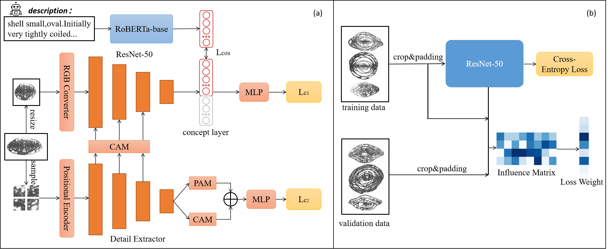

# WDFNet: Detail-Guided and Influence-Aware Learning for Interpretable Fusulinid Fossil Classification
WDFNet is a multi-branch network for fossil image classification. It combines a ResNet-50 backbone with a wavelet-convolutional auxiliary branch, and introduces influence-aware loss reweighting based on pretrained ResNet-50 influence scores. In addition, a concept bottleneck module is incorporated to enhance model interpretability.

## Method Overview
<div align="center">

</div>

- Backbone: ResNet-50
- Auxiliary branch: Wavelet-based Detail-extraction Net
- Patch-based local detail extraction
- Influence function reweighting
- Cosine embedding loss with fossil text descriptions

## Quickstart

1. Install dependencies

```bash
conda create -n cbc python=3.10
conda activate cbc
pip install -r requirements.txt
```

2. Generate augmented datasets

```bash
cd data_preprocessor
python data_augmentation.py
```

3. Generate embeddings of data descriptions

```bash
cd scripts
python generate_text_embedding.py
```
4. Generate influence matrix
```bash
cd scripts
python train_resnet50_influence.py
```

5. Training and evaluation
```bash
cd scripts
python train.py
```


